# My portfolio

This is my portfolio where I am putting my major projects. 

Believe it or not, this is an html- and css-heavy project. I used a little bit of Vanilla Javascript. I was surprised at what a powerful tool CSS can be. 

Here is what the project looks like

## Landing page

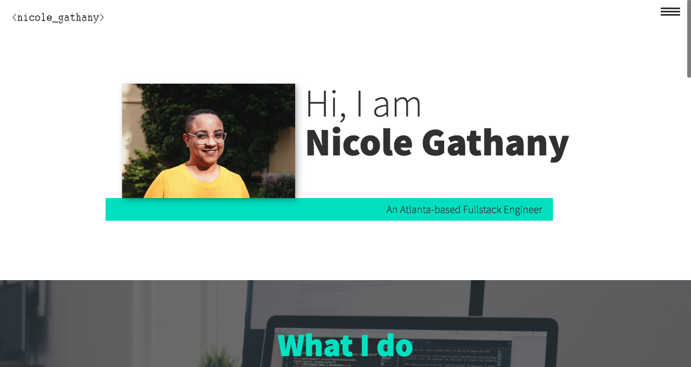

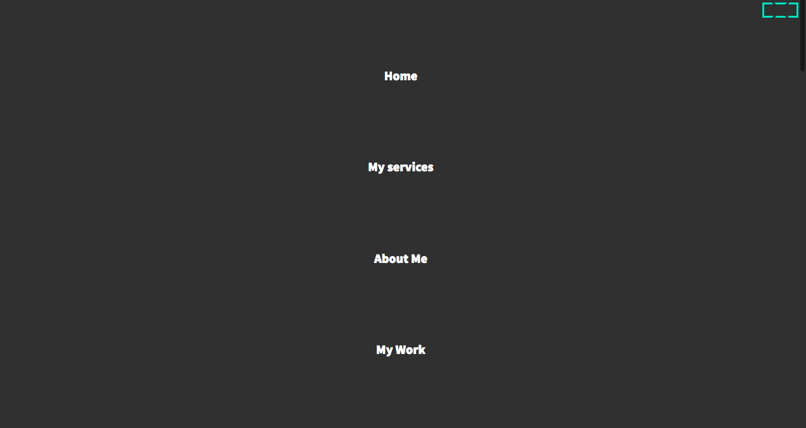

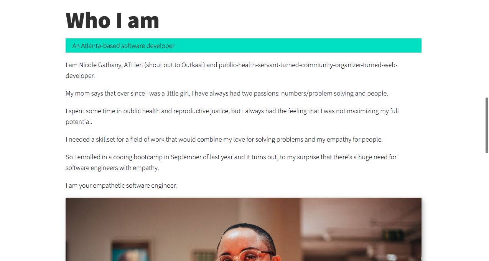

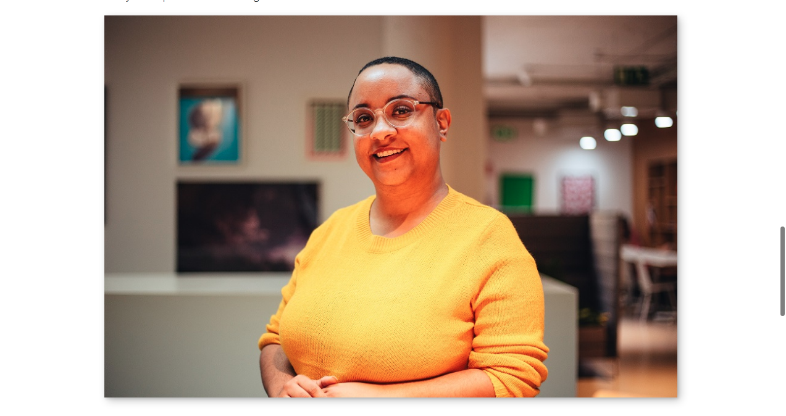

## Projects

### Virtual pets

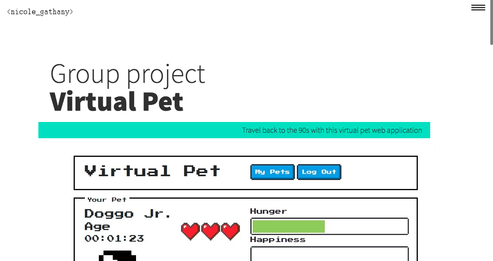

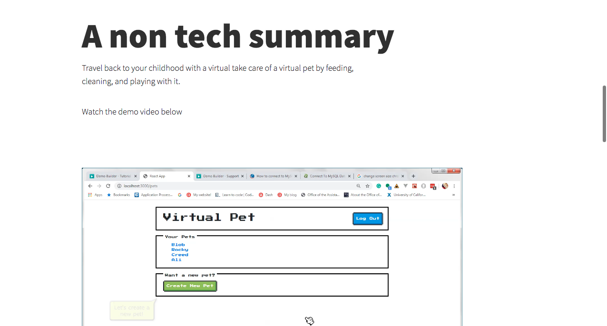

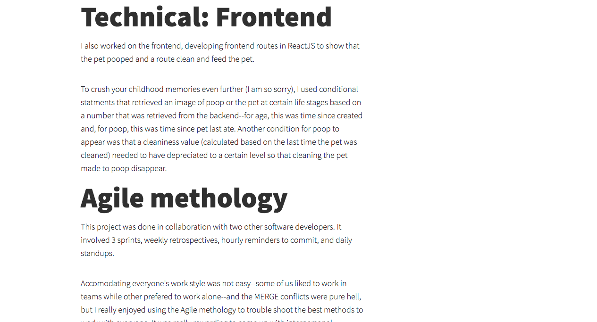

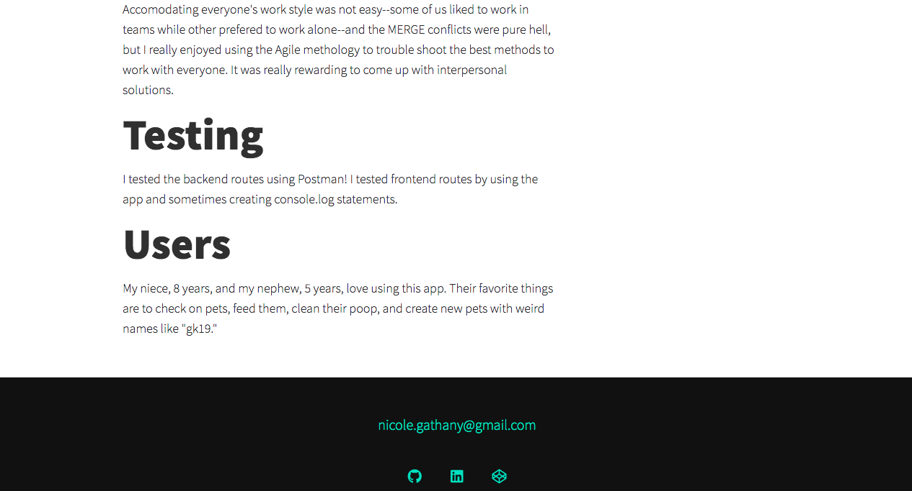

### Asoe Bi Styles

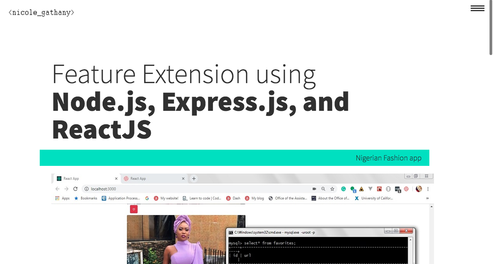

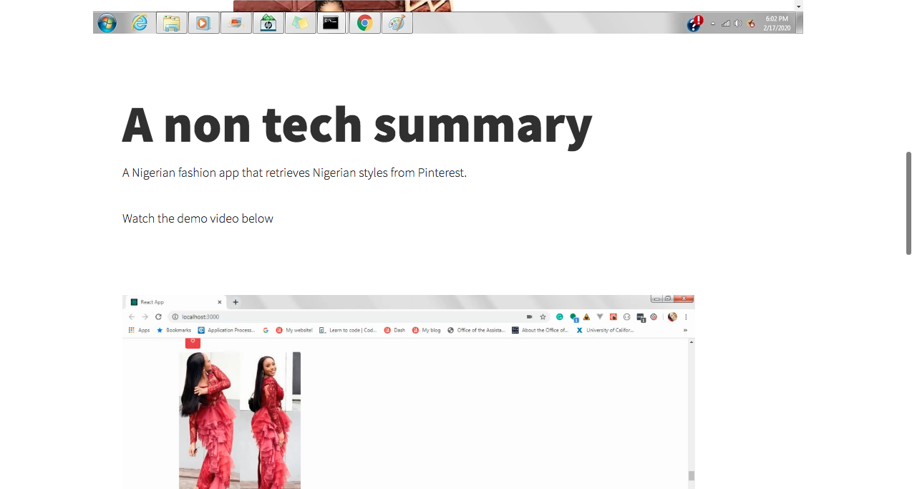

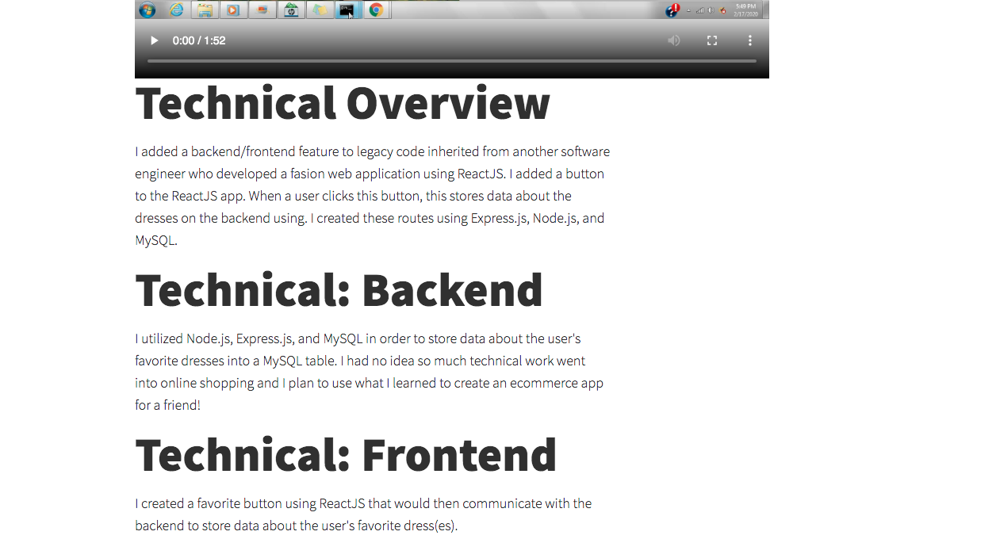

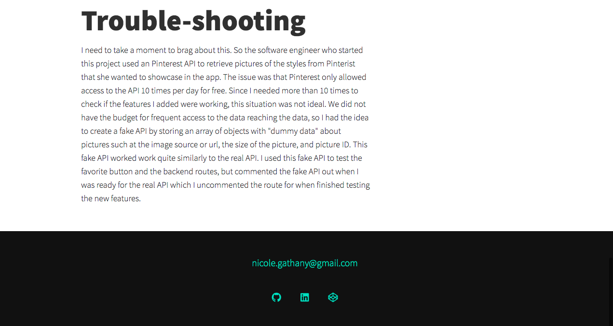

### Astrology App

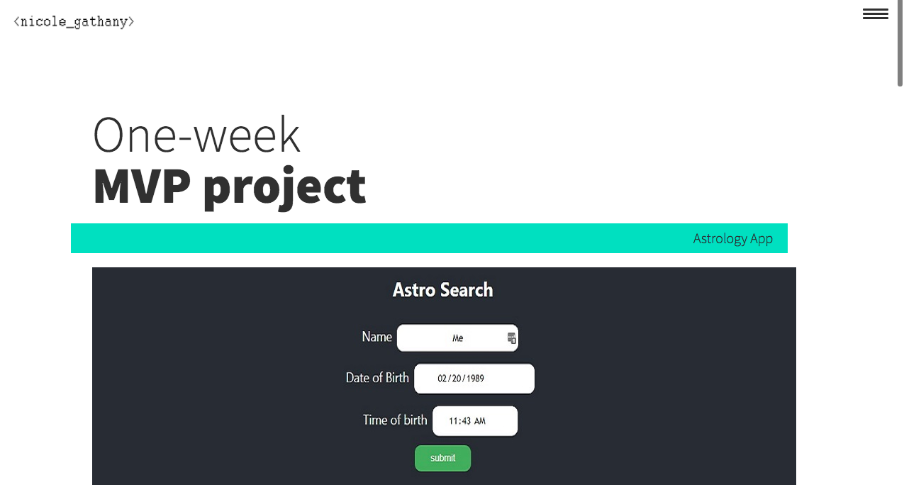
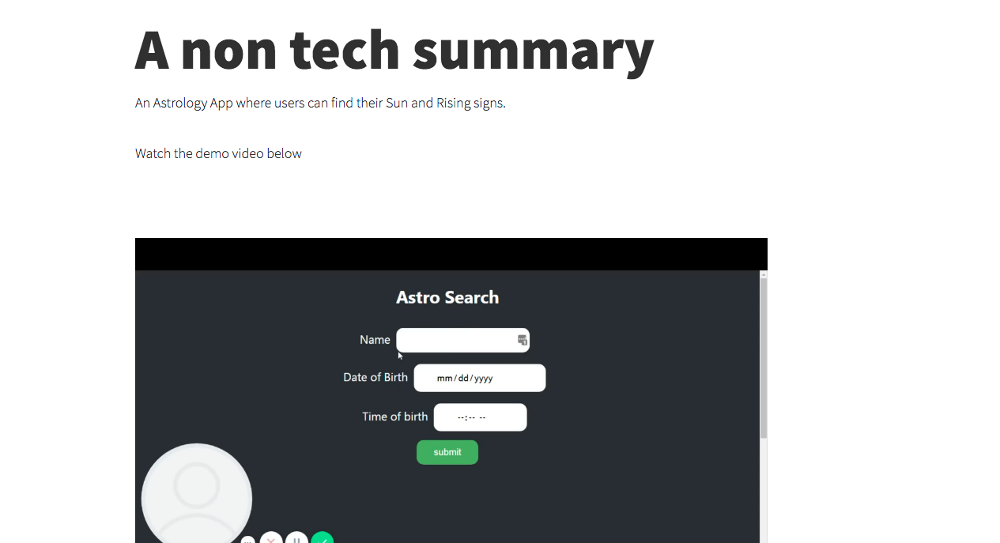
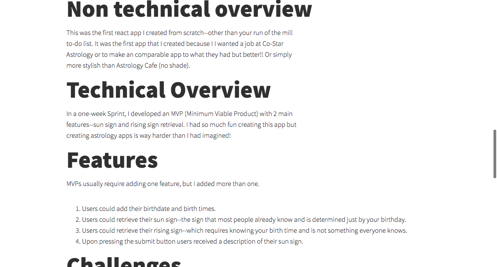
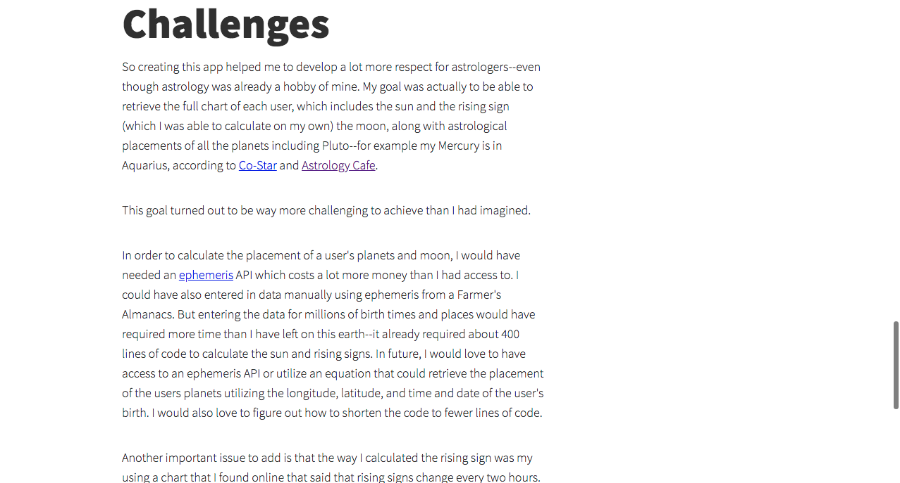

